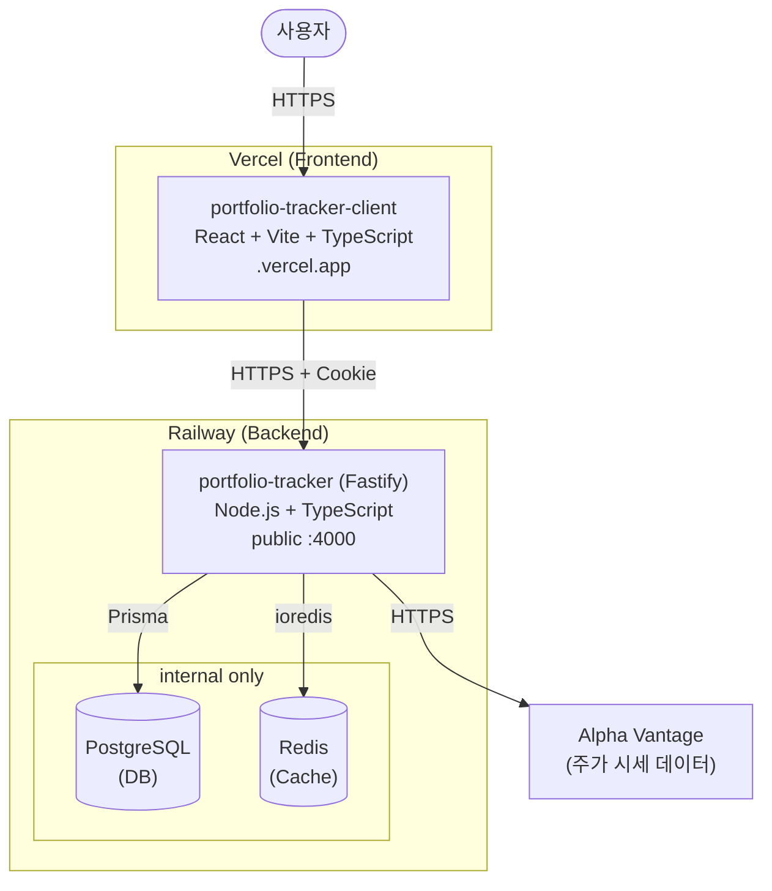

# Architecture

## 시스템 구성



## 요청 흐름

```text
브라우저
│
├─ 정적 파일 (HTML/JS/CSS) → Vercel CDN
│
└─ API 요청 (JSON)
   │
   ├─ Fastify 라우터
   │    ├─ /auth/*       → JWT 인증
   │    ├─ /portfolios/* → 포트폴리오 CRUD (PostgreSQL)
   │    ├─ /holdings/*   → 보유 종목 CRUD (PostgreSQL)
   │    ├─ /watchlist/*  → 관심 종목 (PostgreSQL)
   │    ├─ /quotes/*     → 시세 조회
   │    │    ├─ Redis 캐시 hit  → 즉시 반환
   │    │    └─ Redis 캐시 miss → Alpha Vantage 호출 → Redis 저장
   │    └─ /dashboard    → 집계 데이터
   │
   └─ HTTP-only Cookie (JWT)
```

## 데이터 모델

```text
User
├── Portfolio (1:N)
│    └── Holding (1:N)
└── Watchlist (1:N)
```

## 패키지 구조 (Monorepo)

```text
portfolio-tracker/              ← Turborepo 루트
├── apps/
│   ├── client/                 ← React (Vercel 배포)
│   └── server/                 ← Fastify (Railway 배포)
└── packages/
    └── shared/                 ← Zod 스키마 + 타입 공유
        ├── client import       ← 폼 유효성 검사
        └── server import       ← 요청 데이터 검증
```
